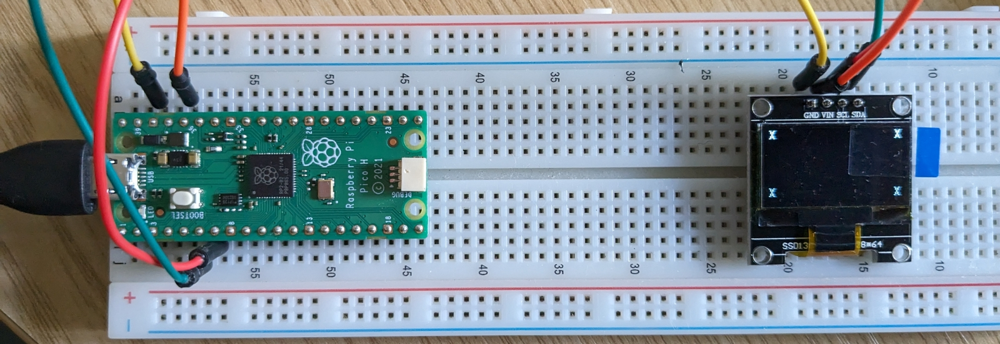

# pico-sh1106-oled

This is a working example of code for the Raspberry Pi Pico which draws
to a SH1106-based OLED screen.

I bought several 0.96" white screens which were advertised as
SSD1306-based. The silkscreen even said they're based on the SSD1306.
But they weren't, they were SH1106-based.

SH1106 is well supported under Arduino (which is why rogue sellers can
get away with deliberately mislabelling them) but it's not well 
supported on the Pico under 'C'. After lots of digging I came up with
several examples of how to get the OLEDs working, but all the examples
were just bits of driver code, or other incomplete odds and ends which
"you can simply integrate into your project."

Eventually I gave in and created a single, simple project, which builds
under the Pico SDK, and produces a binary which will drive a SH1106
OLED screen. Build with:

```
> cd pico-sh1106-oled
> mkdir build
> cd build/
> cmake -DCMAKE_BUILD_TYPE=Debug ..
> make -j10
```

and run the resultant binary on a Pico. It just puts an 'X' in the
corners:



I think there are 1.3" variants of these boards, which might have a
slightly higher resolution? Mine are 128x64.

Anyway, its enough to actually demonstrate your hardware is working
and get you started on your project. :)

## Licence

I went for MIT Licence. Most of this appears to be based on code
which is

Copyright (c) 2021 David Schramm

David went for the MIT Licence, so that seems the reasonable one to
use.

Apologies to those whose code I've not acknowledged. I collected so
much I've long since lost track of who wrote what.

[Derek Fountain](https://www.derekfountain.org/), November 2023